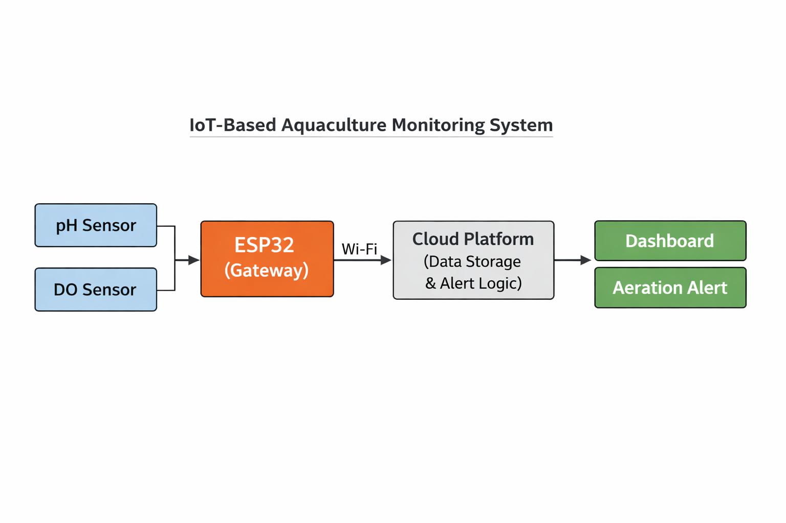

# Smart Aquaculture Water Quality Monitoring System

## Problem Statement
Design an IoT-based monitoring solution for aquaculture to monitor water parameters and trigger alerts when unsafe conditions occur.

## Solution Overview
This project presents an IoT-based smart aquaculture monitoring system that continuously monitors critical water quality parameters such as pH and Dissolved Oxygen (DO). The collected data is transmitted to the cloud, visualized on a dashboard, and used to trigger aeration alerts when threshold limits are violated.

## System Architecture
The system follows a standard IoT edge–cloud architecture.



## Sensor Selection and Justification

 Sensor -- Parameter -- Justification 

1. pH Sensor -- Water pH -- Ensures water acidity/alkalinity is within safe limits for fish.
2. DO Sensor -- Dissolved Oxygen -- Detects low oxygen levels that require aeration. 
3. ESP32 -- Gateway -- Reads sensor data and sends it to the cloud via Wi-Fi.

## Data Flow Explanation
1. pH and DO sensors continuously measure water quality parameters.
2. The ESP32 acts as a gateway and collects sensor readings.
3. Sensor data is transmitted to the cloud through Wi-Fi.
4. The cloud platform stores and processes the data.
5. Alert logic is applied based on predefined threshold values.
6. Aeration alerts are displayed on the dashboard.

## Alert Logic (Aeration Alert)
```
IF (pH < 6.5 OR pH > 8.5)
OR (Dissolved Oxygen < 5 mg/L)
THEN Aeration Alert = ON
ELSE Aeration Alert = OFF

```
## Sample JSON Output

```json
{
  "device_id": "AquaNode_01",
  "pH": 6.2,
  "dissolved_oxygen": 4.3,
  "alert": "Aeration Required",
  "timestamp": "2026-02-06T11:15:00Z"
}
```

## Sample Dashboard Description

The dashboard displays real-time pH and dissolved oxygen values using charts and indicators. When water quality parameters exceed safe thresholds, an aeration alert is highlighted to notify the farmer for immediate action.

## IoT Architecture Understanding

The proposed smart aquaculture monitoring system is designed using a standard IoT layered architecture:

**Sensing Layer:**  
  pH sensor and Dissolved Oxygen (DO) sensor are deployed in the aquaculture pond to continuously measure water quality parameters.

**Edge/Gateway Layer:**  
  An ESP32 microcontroller acts as the IoT gateway, interfacing with the sensors and collecting real-time data.

**Communication Layer:**  
  Sensor data is transmitted from the ESP32 to the cloud using Wi-Fi connectivity.

**Cloud & Application Layer:**  
  The cloud platform stores the incoming data, visualizes it on a dashboard, and manages alert notifications for unsafe conditions.

## Practical Feasibility

1. Low-cost sensors suitable for aquaculture environments
2. Real-time monitoring and cloud-based alerts
3. Scalable architecture for small and large fish farms
4. Reduces manual monitoring and improves fish health

## Edge–Cloud Logic

The system follows an edge–cloud computing model to ensure efficient monitoring and alert generation.

**Edge Processing:**  
  The ESP32 gateway collects sensor readings and performs basic threshold evaluation, such as detecting low Dissolved Oxygen levels.

**Cloud Processing:**  
 topics Cloud servers handle data storage, historical analysis, dashboard visualization, and alert management.

**Alert Mechanism:**  
 When Dissolved Oxygen (DO) falls below the predefined safe threshold, the cloud triggers an aeration alert to notify the user.

This separation of responsibilities reduces latency, improves scalability, and ensures reliable aquaculture monitoring.


## Conclusion

The proposed IoT-based aquaculture monitoring system enables continuous water quality supervision and timely aeration alerts, ensuring a safe and productive aquaculture environment.


